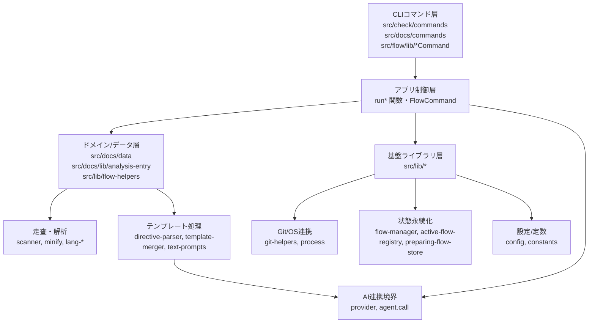

<!-- {{data("base.docs.langSwitcher", {labels: "relative"})}} -->
**日本語** | [English](../internal_design.md)
<!-- {{/data}} -->

# 内部設計

## 説明

<!-- {{text({prompt: "この章の概要を1〜2文で記述してください。プロジェクト構成・モジュール依存の方向・主要な処理フローを踏まえること。"})}} -->

このプロジェクトは、`src/check`・`src/docs`・`src/flow`・`src/lib` の各層に責務を分離し、CLI コマンド層から共通ライブラリ層へ依存する一方向の構成で実装されています。
代表的な処理は、ソース走査（`docs scan`）で `analysis.json` を生成し、必要に応じて enrich/data/readme/translate で再利用し、`check scan` で網羅率を検証して出力形式別に可視化する流れです。
<!-- {{/text}} -->

## 内容

### プロジェクト構成

<!-- {{text({prompt: "このプロジェクトのディレクトリ構成を tree 形式のコードブロックで記述してください。主要ディレクトリ・ファイルの役割コメントを含めること。ソースコードの実際の構成から生成すること。", mode: "deep"})}} -->

```text
src/
├─ check/
│  └─ commands/
│     └─ scan.js                 # 解析済みデータと対象ファイルを比較し、走査カバレッジを出力
├─ docs/
│  ├─ commands/                  # docs scan/init/data/enrich/readme/translate/agents の実行制御
│  ├─ data/                      # {{data(...)}} 用 DataSource（agents/docs/lang/text）
│  └─ lib/                       # ディレクティブ解析、テンプレート統合、走査、minify、プロンプト構築
├─ flow/
│  └─ lib/                       # SDD フロー進行制御（next-action、status、prepare、auto-check など）
└─ lib/
   ├─ flow-manager.js            # flow 状態の永続化・探索・更新の中核
   ├─ flow-helpers.js            # ステップ/フェーズ定義と派生ロジック
   ├─ provider.js                # エージェントプロバイダ抽象化（Claude/Codex/User）
   ├─ git-helpers.js             # git/gh 操作の共通ラッパー
   └─ constants.js               # フェーズ・状態・終了コードなどの定数群
```
<!-- {{/text}} -->

### モジュール構成

<!-- {{text({prompt: "主要モジュールの一覧を表形式で記述してください。モジュール名・ファイルパス・責務を含めること。ソースコードの import/require 関係と各ファイルのエクスポートから抽出すること。", mode: "deep"})}} -->

| モジュール | ファイルパス | 責務 |
| --- | --- | --- |
| CheckScanCommand | `src/check/commands/scan.js` | include/exclude と `analysis.json` を突合し、未解析ファイルと拡張子別分布を `text/json/md` で出力します。 |
| DocsScanCommand | `src/docs/commands/scan.js` | 走査対象ファイル収集、DataSource 読み込み、既存分析の再利用、`analysis.json` 更新を実行します。 |
| DocsEnrichCommand | `src/docs/commands/enrich.js` | 解析エントリをバッチ化して AI 補完し、chapter/summary/detail/role/keywords を統合保存します。 |
| DocsDataCommand | `src/docs/commands/data.js` | `resolveDataDirectives` と resolver を使って docs 内の `{{data(...)}}` を展開します。 |
| DocsInitCommand | `src/docs/commands/init.js` | テンプレート解決・継承マージ・章選択を行い、`docs/` 初期ファイルを生成します。 |
| DocsReadmeCommand | `src/docs/commands/readme.js` | README テンプレートの data/text 解決と必要時の AI テキスト補完を実行します。 |
| DocsTranslateCommand | `src/docs/commands/translate.js` | 言語設定と更新日時に基づいて翻訳タスクを作成し、並列翻訳して言語別出力を生成します。 |
| FlowManager | `src/lib/flow-manager.js` | `FlowStore`・`ActiveFlowRegistry`・`PreparingFlowStore` を束ねて flow 状態を管理します。 |
| RunPrepareSpecCommand | `src/flow/lib/run-prepare-spec.js` | spec ディレクトリ初期化、branch/worktree 判定、`spec.json/spec.md/qa.md/draft.md` 作成を担当します。 |
| ProviderRegistry | `src/lib/provider.js` | 実行プロファイルと出力パーサを抽象化し、CLI から利用するエージェント実装差を吸収します。 |
<!-- {{/text}} -->

### モジュール依存関係

<!-- {{text({prompt: "モジュール間の依存関係を mermaid graph で生成してください。ソースコードの import/require を解析し、レイヤー構造と依存方向を示すこと。出力は mermaid コードブロックのみ。", mode: "deep"})}} -->


<!-- {{/text}} -->

### 主要な処理フロー

<!-- {{text({prompt: "代表的なコマンドを実行した際のモジュール間のデータ・制御フローを番号付きステップで説明してください。エントリポイントから最終出力までの流れを含めること。", mode: "deep"})}} -->

1. `sennel docs scan` 実行時、`src/docs/commands/scan.js` が引数と docs コンテキストを解決し、include/exclude ルールで対象ソースを収集します。
2. 同コマンドは DataSource 群を読み込み、各ファイルをカテゴリごとに解析してエントリを作成し、既存 `analysis.json` の ID・ハッシュ情報を再利用します。
3. 解析結果は `.sennel/analysis.json` に保存され、以降の `docs enrich`・`docs data`・`docs readme` が同一データを参照します。
4. `sennel docs data` では `src/docs/commands/data.js` が `directive-parser` と resolver を使い、`{{data(...)}}` ブロックを各 DataSource 出力で置換します。
5. `sennel docs readme`/`docs translate` はテンプレート解決後に必要な AI 呼び出しを行い、README や多言語 docs を更新します。
6. `sennel check scan` では `src/check/commands/scan.js` が走査対象と `analysis.json` を比較し、未解析ファイル一覧・拡張子別件数・カバレッジ率を最終出力します。
<!-- {{/text}} -->

### 拡張ポイント

<!-- {{text({prompt: "新しいコマンドや機能を追加する際に変更が必要な箇所と、拡張パターンを説明してください。ソースコードのプラグインポイントやディスパッチ登録パターンから導出すること。", mode: "deep"})}} -->

- 新しい docs 系コマンドを追加する場合は `src/docs/commands/<name>.js` に `run<Name>` 関数と `Command` 継承クラスを実装し、既存コマンドと同様に `ctx.docsCtx` と `ctx._rawArgs` を受ける形に合わせます。
- flow サブコマンドを追加する場合は `src/flow/lib` で `FlowCommand` を継承し、`requiresFlow` と `execute(ctx)` の契約を守って `flow.json` 前提条件を統一します。
- `{{data(...)}}` の新しい供給元を増やす場合は `src/docs/data/*.js` に `register(container)` 形式の DataSource クラスを追加し、メソッド単位でテンプレートから参照可能にします。
- 対応言語を増やす場合は `src/docs/lib/lang/<ext>.js` を追加し、`src/docs/lib/lang-factory.js` の `EXT_MAP` に拡張子マッピングを登録します。
- next-action の分岐や指示文を拡張する場合は、`src/flow/lib/get-next-action.js` が読む schema/prompt（`context-rules.json` と step instructions）を追加し、`<phase>.<step>` キー規約を満たす必要があります。
- エージェント実行プロファイルを増やす場合は `src/lib/provider.js` の `builtinProfiles` またはユーザープロファイル解決経路に追加し、出力パース仕様を Provider 単位で定義します。
<!-- {{/text}} -->

---

<!-- {{data("base.docs.nav")}} -->
[← 設定とカスタマイズ](configuration.md) | [プリセット作成ガイド →](creating_presets.md)
<!-- {{/data}} -->
